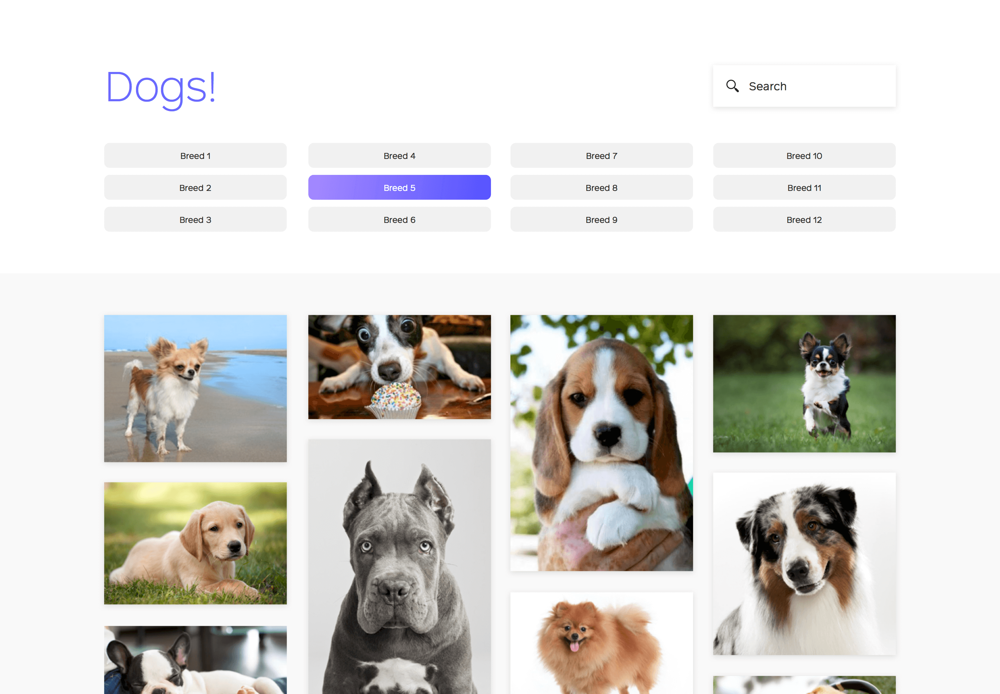
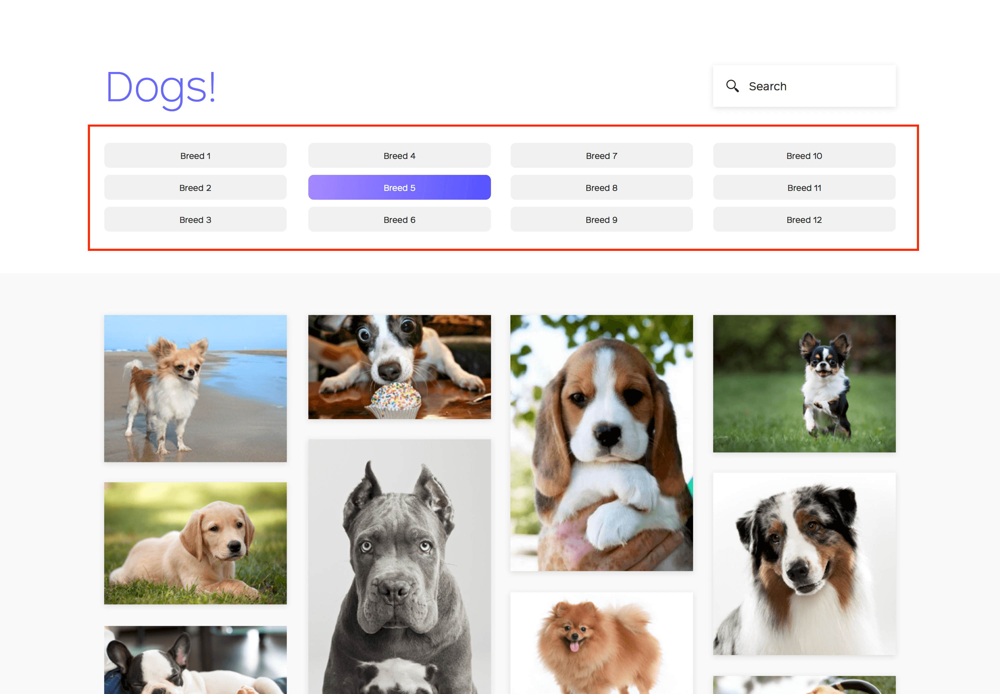
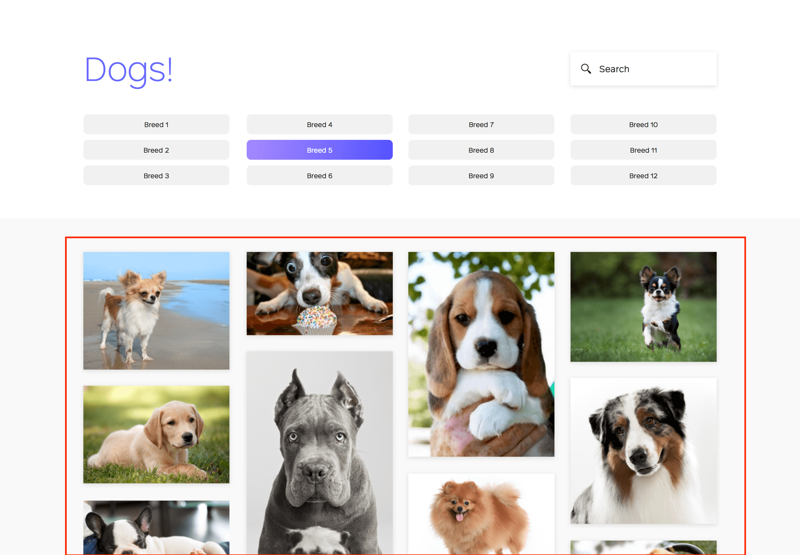
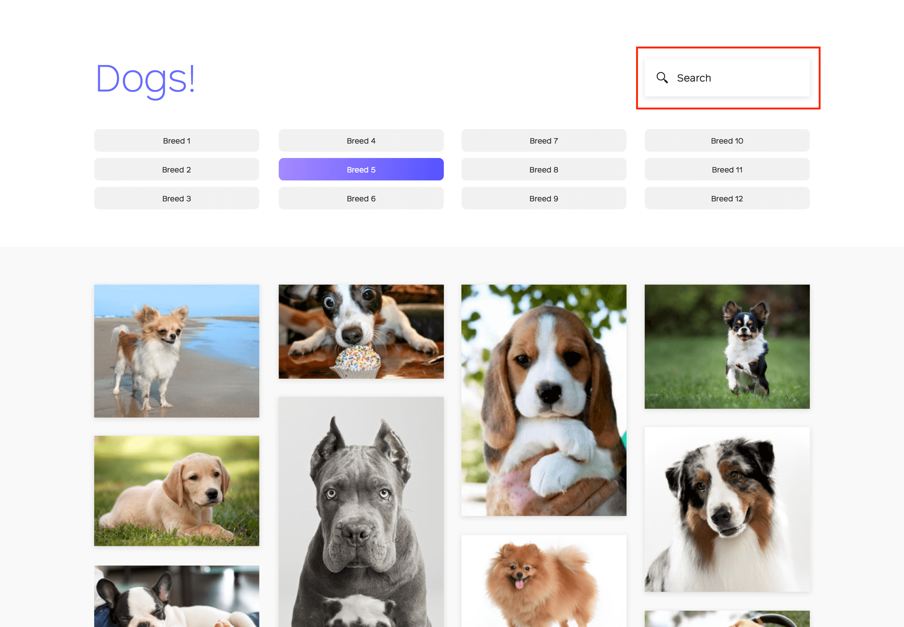

# Renew Front-end Code Test

//  update buttons 
// add default for activeDogBreed
// fixed size for doggos; use crop


// Search bar that filters on the breeds.
As the user types characters into the box, the list of breeds should be filtered

This does not need to re-ping the api, it just needs to filter the local data from your store

Make the grid views responsive (4 columns on desktop, 2 on tablet, 1 on mobile)




## Tech Stack
- React
- Redux
- SASS
- Webpack (No knowledge or configuration required - all setup for you)
- Express (No knowledge or configuration required - all setup for you)

### To Run the Project
- npm install
- npm run dev
- go to localhost:8000

## Project Structure

The following directories and files are they only ones you will have to use to complete this code test.

- `BasePage.jsx` is the root file of the application. It currently contains `SampleContainer.jsx`
- `reducers/` has one `sample.js` reducer now. If you implement any reducers, place them in this directory and import them in `reducers/index.js`.
- `actions/` has one `sample.js` actions file now. If you implement any actions, place them in this directory.
- `pages`, `components`, and `containers`, are setup where Pages can contain multiple Containers, which contain Components, but feel free to structure this any way you would like.
- `SampleContainer.jsx` has an example interaction with the redux store
- Do not worry about the other directories, such as `app/store/`, `config/`, `server/`, and `webpack/`

```
.
├── README.md
├── app/
│   ├── actions/
│   │   └── sample.js
│   ├── components/
│   │   ├── scss/
│   │   └── Sample.jsx
│   ├── containers/
│   │   ├── scss/
│   │   └── SampleContainer.jsx
│   ├── pages/
│   │   └── BasePage.jsx
│   ├── reducers/
│   │   ├── index.js
│   │   └── sample.js
└── package.json
```

- Following this structure exactly is not required, but should aid you in the coding test.
- You can add any npm module or js to this project that you need.

## Problem

Utilize the [Dog API](https://dog.ceo/dog-api/) to create a one page application. Complete the parts in order.

### Part 1



Top section should contain the first 12 dog breeds that come back from the API

- https://dog.ceo/api/breeds/list

### Part 2



Clicking any breeds drops down a grid of images of that breed and highlights that breed's button.

- https://dog.ceo/api/breed/{breed_name}/images
- These can all be of a fixed size (unlike the design). Make a best-effort attempt at the cropping of the images

### Bonus



Search bar that filters on the breeds.

- As the user types characters into the box, the list of breeds should be filtered
- Always show 12 breeds, unless there are fewer than 12 after filtering
- This does not need to re-ping the api, it just needs to filter the local data from your store

### Additional Bonuses
- Make the grid views responsive (4 columns on desktop, 2 on tablet, 1 on mobile)
- Make the grid dynamically sized (like in the design)

## What we're looking for
- Does it work?
- Does it match the designs
- Coding style
- Efficiency of search bar filtering
